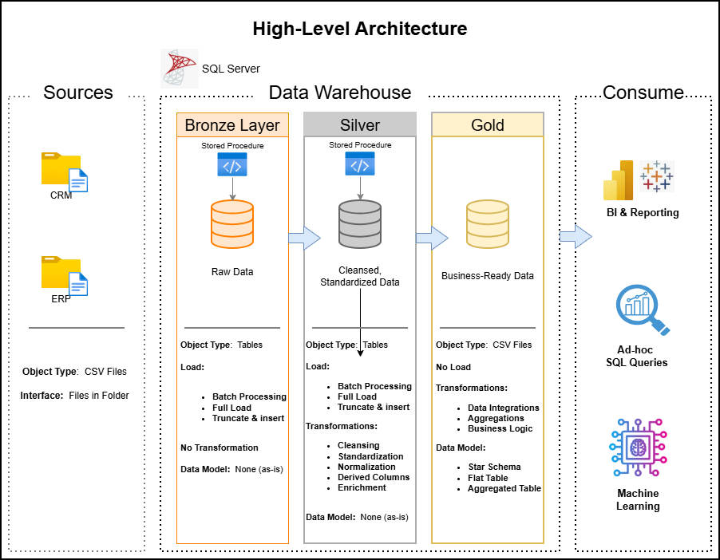

# :rocket: sql-data-warehouse-project

Welcome to my **sql-data-warehouse-project** repository!

This project was my first attempt at learning SQL and building a data warehouse via an online course delivered by Baraa Khatib Salkini (AKA DataWithBaraa). Not only is this my first attempt at SQL and data warehouse fundamentals....it is also my first time working in Git and building a repo.

This project serves as the first portfolio project entry in Git and it highlights what I  learned.

I fully documented each step of the entire project.  If you're looking for good toilet reading --> **[TEST]**

I strongly recommend checking out Baraa's Git page and exploring some of his courses --> **[DataWithBaraa](https://github.com/DataWithBaraa)**

## Project Requirements

### Building the Data Warehouse (Data Engineering)

#### Objective
Develop a data warehouse based on the Medallion Architecture using SQL Server to consolidate sales data, enabling analytical reporting and informed decision-making.

The data architecture diagram below depicts the Medallion Architecture used for this project

#### Specifications
- **Data Sources**: Import data from two source systems (ERP and CRM) provided as CSV files.
- **Data Quality**: Cleanse and resolve data quality issues prior to analysis.
- **Integration**: Combine both sources into a single, user-friendly data model designed for analytical queries.
- **Scope**: Focus on the latest dataset only; historization of data is not required.
- **Documentation**: Provide clear documentation of the data model to support both business stakeholders and analytics teams.

---

### BI: Analytics & Reporting (Data Analysis)

#### Objective
Develop SQL-based analytics to deliver detailed insights into:
- **Customer Behavior**
- **Product Performance**
- **Sales Trends**

These insights empower stakeholders with key business metrics, enabling strategic decision-making.

---

## License

This project is licensed under the [MIT License].(LICENSE). You are free to use, modify, and share this project with proper attribution.

## About Me

Hi there!  I'm Tom.  I am a non-technical IT Strategy Consultant (as of 2025) with over 10 years of experience.  I am on a journey to shift away from the world of high-level, conceptual IT strategy and into a new path in which I have deep technical expertise in data engineering, analytics, and data architecture.  This is my first step.

